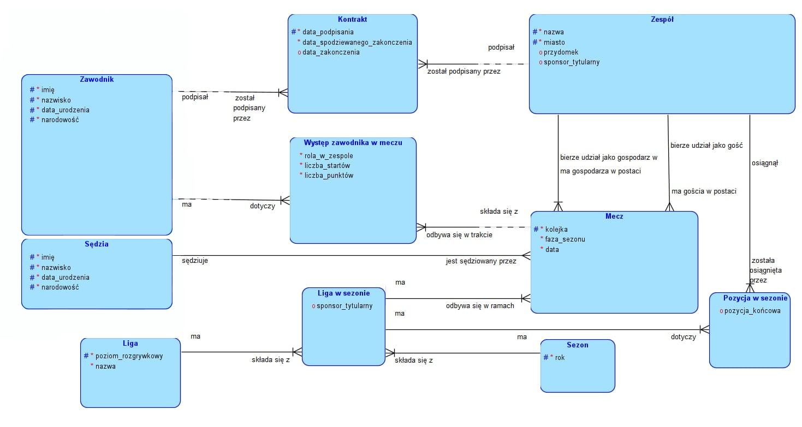

### Aplikacja ORACLE APEX do zarządzania ligą żużlową
1. Encje i relacje w aplikacji:

2. Aplikacja
2.1. Strona główna
2.2  Zarządzanie sezonem
2.3  Zarządzanie drużyną
2.4  Klasyfikacja
2.5  Tworzenie meczu

   
 
