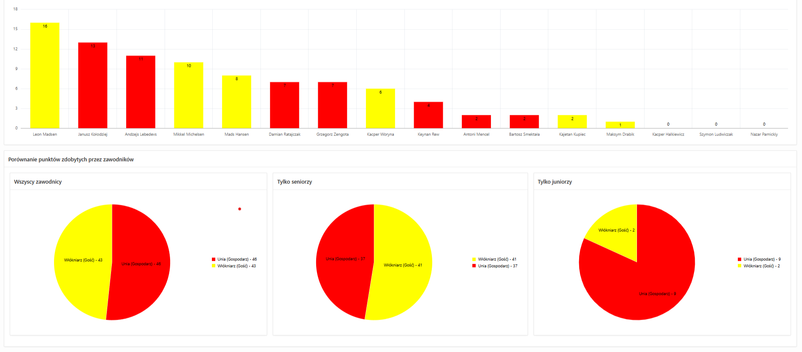

### Aplikacja ORACLE APEX do zarządzania ligą żużlową
1. Encje i relacje w aplikacji:

Kod DDL oraz inne funkcje i procedury można podejrzeć w pliku <a href='kod.sql'>kod.sql</a>

2.1. Strona główna

2.2 Widok sezonu

2.3  Raport meczu

2.4  Raport zawodnika

2.5  Raport zespołu

   
 
